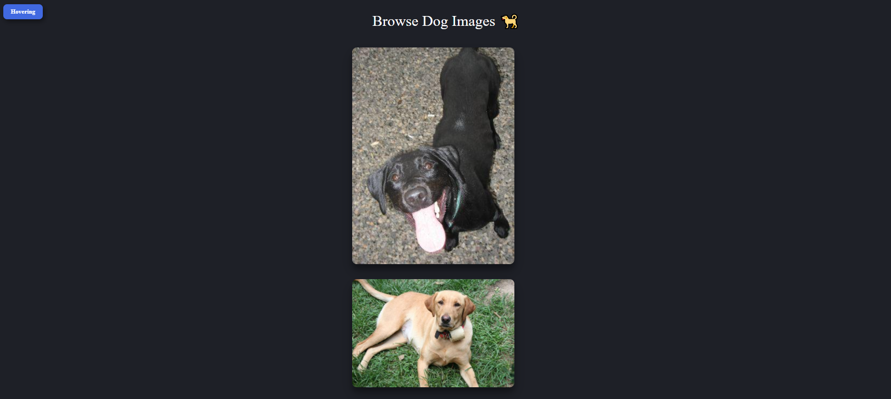

# HOC PATTERN (Higher Order Component)

> A Higher Order Component (HOC) is a component that receives another component. The HOC contains certain logic that we want to apply to the component that we pass as a parameter. After applying that logic, the HOC returns the element with the additional logic.

