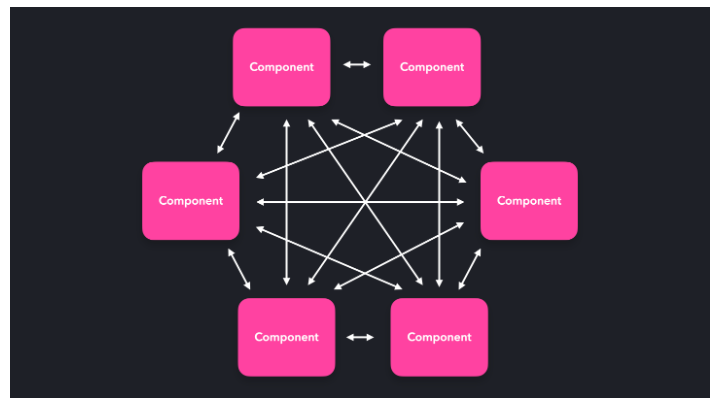
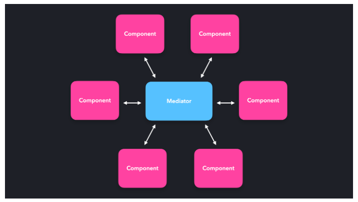

# MEDIATOR PATTERN

> The mediator pattern makes it possible for components to interact with each other through a central point: the mediator. Instead of directly talking to each other, the mediator receives the requests, and sends them forward! In JavaScript, the mediator is often nothing more than an object literal or a function.

[]

> Instead of letting every objects talk directly to the other objects, resulting in a many-to-many relationship, the object's requests get handled by the mediator. The mediator processes this request, and sends it forward to where it needs to be.

[]
